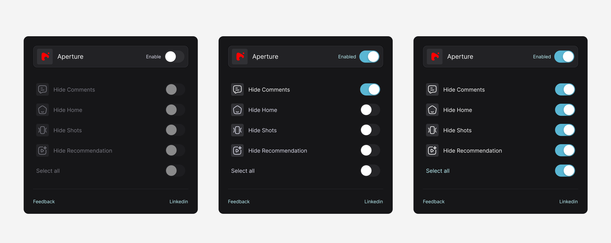
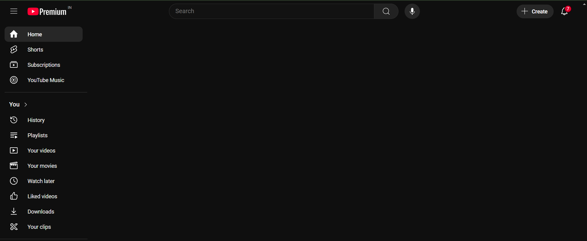

# **Aperture - YouTube Distraction Blocker**

  
**Aperture** is a Chrome extension designed to help you stay focused while using YouTube. It allows you to hide distracting elements like comments, recommendations, and the homepage, so you can concentrate on what matters most.

---

## **Features**

- **Hide Comments**: Remove the comments section from YouTube videos.
- **Hide Recommendations**: Block recommended videos on the sidebar and homepage.
- **Hide Homepage**: Replace the YouTube homepage with a clean, distraction-free interface.
- **Customizable**: Toggle each feature individually or use the "Select All" option.
- **Hide Shorts Menu**: Remove the Shorts menu from YouTube menu.
- **Sync Across Devices**: Your preferences are saved and synced across all your devices (if logged into Chrome).

---

## **Screenshots**

### Popup UI

  
_The popup allows you to toggle features on and off._

### Clean YouTube Interface

  
_YouTube with distractions removed for a focused experience._

---

## **Installation**

### **Option 1: Install from Chrome Web Store**

1. Visit the [Aperture Chrome Web Store page](https://chrome.google.com/webstore/detail/aperture/your-extension-id).
2. Click **Add to Chrome**.
3. Confirm by clicking **Add Extension**.

### **Option 2: Install Manually**

1. Download the extension files from the [GitHub repository](https://github.com/your-username/aperture).
2. Extract the files to a folder on your computer.
3. Open Chrome and go to `chrome://extensions/`.
4. Enable **Developer Mode** (toggle in the top-right corner).
5. Click **Load unpacked** and select the folder where you extracted the files.

---

## **How to Use**

1. Click the Aperture icon in the Chrome toolbar to open the popup.
2. Toggle the checkboxes to hide/show:
   - **Comments**
   - **Recommendations**
   - **Homepage**
   - **Shorts Menu**
3. Use the **Select All** option to enable/disable all features at once.
4. Refresh the YouTube page to see the changes.

---

## **Technical Details**

- **Built With**: HTML, CSS, JavaScript, Chrome Extensions API.
- **Storage**: Uses `chrome.storage.sync` to save and sync user preferences.
- **Permissions**:
  - `storage`: To save user preferences.
  - `activeTab`: To interact with the YouTube page.
  - `*://*.youtube.com/*`: To run the extension on YouTube.

---

## **Credits**

- **Icon**: Designed by [Your Name/Designer Name].
- **Inspiration**: Inspired by the need to reduce distractions while using YouTube.

---

## **Support**

If you encounter any issues or have suggestions, please [open an issue](https://github.com/your-username/aperture/issues) on GitHub.

---

Enjoy a distraction-free YouTube experience with **Aperture**! 🚀
